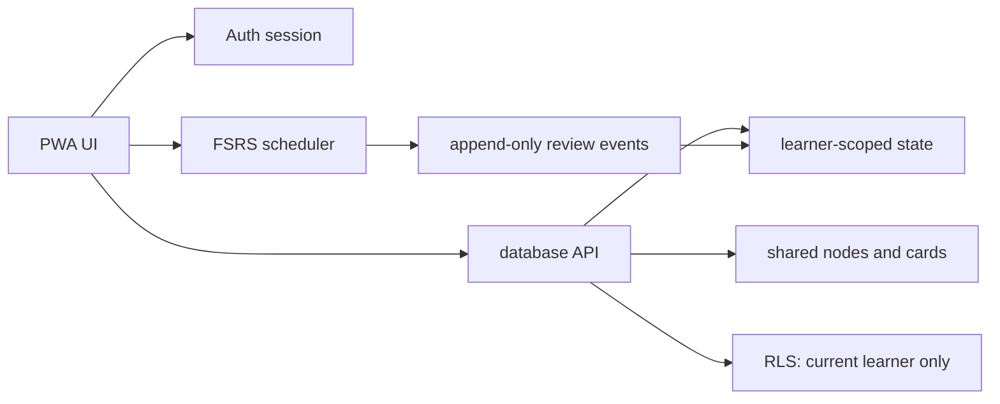

# Architecture and Data Boundaries

## Proposed MVP stack

- React + TypeScript + Vite (phone-first SPA/PWA).
- `ts-fsrs` for browser scheduling; pin the exact version in the lockfile after a focused scheduler test.
- Supabase Auth + Postgres with Row Level Security (RLS) for the two accounts, shared content, and per-learner state. This is a proposal, not an installed dependency or a deployment decision.
- Service worker and web app manifest for installability and shell caching.
- Playwright or equivalent browser tests only after the app has a runnable baseline; do not add a test framework solely for appearance claims.

The stack keeps the app small: a static frontend, one data/authorization boundary, and a deterministic scheduling module. A different backend is acceptable only if it preserves the same contracts and rollback path.

## Cloudflare deployment target

Cloudflare is the intended hosting target, but deployment is a later owner-approved step. The frontend must be a reproducible build that can be published to Cloudflare Pages; Pages supports framework/static builds, preview deployments, and server-side Pages Functions when a small API is needed ([Pages static deployment](https://developers.cloudflare.com/pages/framework-guides/deploy-anything/), [Pages Functions](https://developers.cloudflare.com/pages/functions/)).

Choose exactly one data/authorization path before implementing persistence:

1. **Managed-data path:** Cloudflare Pages for the frontend plus Supabase Auth/Postgres/RLS. The browser may contain only the public client key; the service-role key must never enter the bundle. CORS, redirect URLs, and RLS policies are production configuration, not UI assumptions.
2. **Cloudflare-native path:** Cloudflare Pages/Pages Functions or a Worker API plus D1. The Worker owns password hashing, session cookies, authorization checks equivalent to RLS, migrations, and idempotent review writes. D1 is not a substitute for those policies.

Do not build both paths in the MVP. Keep a small data-adapter interface so the choice is reversible before real learner history exists. If a Worker is used, keep its Wrangler configuration in version control; Cloudflare recommends `wrangler.jsonc` as the source of truth for new Worker projects ([Wrangler configuration](https://developers.cloudflare.com/workers/wrangler/configuration/)).

Deployment requirements:

- HTTPS is mandatory for authentication, service workers, and any future Web Push permission flow.
- No credentials, private answer content, or server-only environment values may be present in `dist/`, source maps, logs, or Git history. Use Pages/Worker environment variables and secrets; commit only an `.env.example` with names and safe placeholders.
- Production and preview environments must use separate data bindings/redirect allowlists. A preview must not write to the production learner database.
- The service worker may cache the app shell and published, non-private card data only. Never cache authenticated API responses or private notes in a shared cache. Show an explicit offline/sync status and preserve idempotency keys for queued writes.
- Add a deployment smoke check before the first release: `GET /health`, login for both accounts, a cross-account negative authorization check, one review write, manifest/service-worker installability, no-secret scan of the build artifact, and CSP/CORS checks.
- Record the Pages deployment ID or Worker version, schema migration identity, and backup location in `50-Evidence/` for every production release. Rollback must mean selecting the previous frontend/Worker version and applying a tested reversible migration path; never erase review events.
- Do not deploy from a local direct upload as the only source of truth. Keep the Git-connected build reproducible so another AI can reproduce or roll back it.

## Data ownership

Shared tables: `profiles` (allowlisted identity), `concept_nodes`, `concept_edges`, `cards`, `card_sources`, `card_revisions`.

Per-learner tables: `learner_card_states`, `review_events`, `study_sessions`, `streaks`, `learner_preferences`, `private_notes`.

Every review event has a client-generated idempotency key, learner ID from the authenticated session, card ID, old state hash, new state, rating, attempt kind, occurred-at timestamp, and app version. The server rejects a learner ID supplied by the client that differs from the session.

## Authorization invariants

- Only the two explicitly created accounts can sign in.
- Both learners can read published shared cards and map structure.
- Card creation/edit/archive is limited to the project’s content role; the MVP may give that role to both accounts but must record author and reviewer.
- A learner can read/write only their own review state, logs, preferences, streak, and private notes.
- No policy relies on a hidden UI control. Test RLS with positive, negative, and cross-account cases.

## Offline and synchronization

MVP offline means the app shell, cached published cards, and the current study queue remain usable when the network drops. Writes are queued locally with the idempotency key and visible sync status. The server is authoritative for shared content and accepted review events; conflicts are surfaced, not silently overwritten. Full offline multi-device merge is a later gate, not an implied feature of “PWA”.

## Notifications (Phase 2)

Do not build push into the first slice. Web Push requires HTTPS, explicit user permission, a service worker, a subscription endpoint, and a server delivery path. Apple documents Home Screen web-app push on iOS/iPadOS 16.4+ and requires a user gesture for permission ([Apple Web Push](https://developer.apple.com/documentation/usernotifications/sending-web-push-notifications-in-web-apps-and-browsers)); mobile notifications should use `ServiceWorkerRegistration.showNotification()` and permission should be requested from a gesture ([MDN Notifications](https://developer.mozilla.org/en-US/docs/Web/API/Notifications_API/Using_the_Notifications_API)).

When enabled, notifications are opt-in per learner, quiet-hours aware, rate limited, revocable, and never include private answer content in the payload. The first reminder should be a single daily due summary, not pressure after every missed card.

## Recovery

- Before migrations or deployment, export a database backup and record the schema/revision identity.
- Migrations are additive and reversible where possible; never delete review history to “fix” a scheduler.
- If sync becomes unsafe, disable writes, keep local review queue visible, and roll back the last app release while preserving raw events.
- A release is not complete until schema, RLS, scheduler, accessibility, and PWA smoke gates pass on the same artifact.
